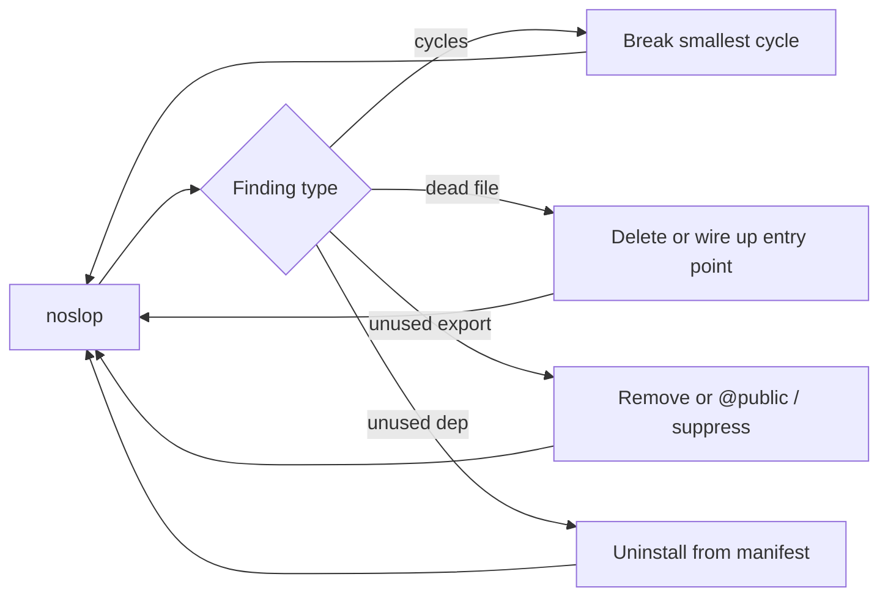
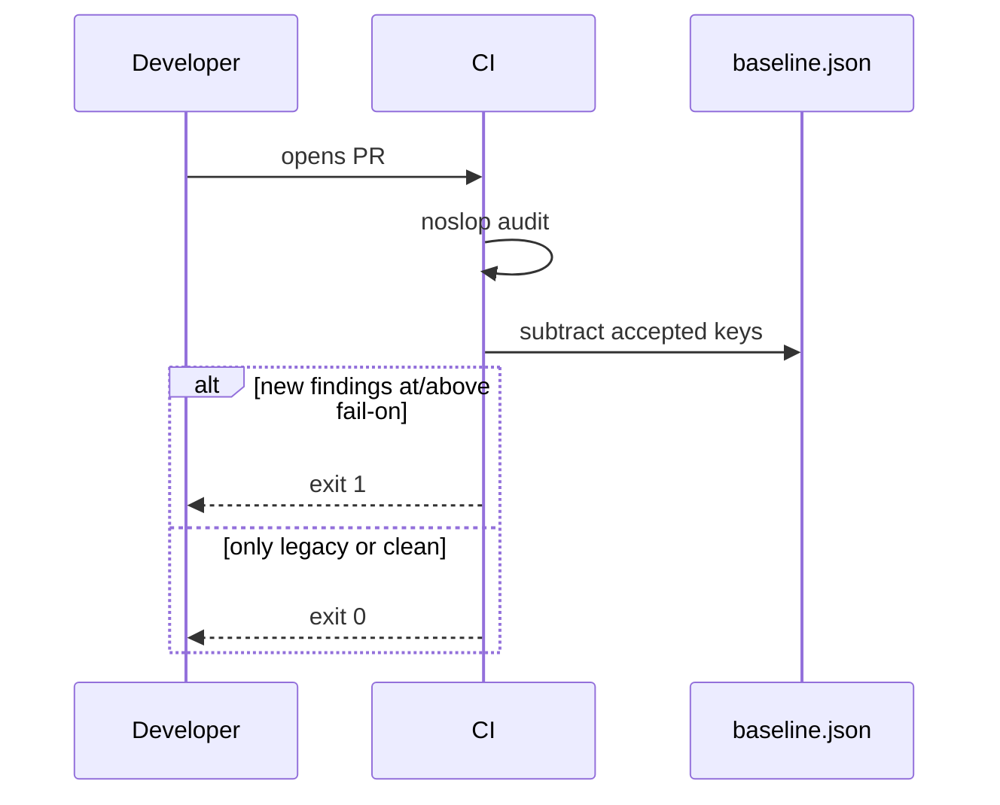

<div align="center">


<br />

[](https://github.com/noslopcode/noslopcode)
[](https://github.com/noslopcode/noslopcode/blob/main/Cargo.toml)
[](https://www.rust-lang.org)
[](https://github.com/noslopcode/noslopcode)

<br />

**One scan. TypeScript and Python. Dead code, cycles, complexity, and a health grade — deterministic, monorepo-aware, zero-config.**

[Quick start](#quick-start) · [How to use it](#how-to-use-it-effectively) · [CI ratchet](#ci-ratchet) · [Rules](#rules) · [Architecture](./ARCHITECTURE.md)

</div>

---

## What it does

`noslop` walks your repo — **monorepos and workspaces included** — builds an import graph across **TypeScript/JavaScript and Python**, and tells you what is actually dead: files nobody reaches, exports nobody imports, dependencies nobody uses, cycles that will bite you later.

Unlike linters that check syntax, noslop answers **reachability**: _is this code part of the live system?_

```
discover → extract → resolve → analyze → report
```

One binary. No `tsc`. No `mypy`. No network calls. Same input → same JSON every time.

| You get                           | Why it matters                                                               |
| --------------------------------- | ---------------------------------------------------------------------------- |
| **Dead-code triage**              | Delete with confidence instead of guessing                                   |
| **Health grade + ranked targets** | Know where to start — highest payoff, lowest effort                          |
| **CI ratchet**                    | Block _new_ slop without a big-bang cleanup                                  |
| **Agent-ready JSON**              | Machines read findings; humans read the pretty report                        |
| **Framework auto-detection**      | Next.js, FastAPI, Django, pytest, and more — no hand-maintained ignore lists |

---

## See it work

```bash
cargo install --path crates/noslop-cli
noslop --root fixtures/mixed
```

```
  noslopcode v0.1.0
  2 workspaces · 9 files · warm cache · 0.0s

  repo · health F (18.9)  ·  dead files 22.2% (2)  ·  exports 2  ·  cycles 1  ·  deps 2

  5 refactor targets - start with apps/api/app/cycle_a.py
    1. apps/api/app/cycle_a.py  cycle · small · payoff 12.0 · circular import
    2. apps/api/app/dead_tool.py  dead file · small · payoff 8.0 · unused file
    3. apps/web/src/lib/orphan.ts  dead file · small · payoff 8.0 · unused file

  apps/api
  ──────────────────────────────────────────────────────────────
    python · 6 files
    _fallback, fastapi
    dead files 16.7% (1)  · exports  0 ·  cycles 1

  Unused files (1)
    apps/api/app/dead_tool.py

  Circular imports (1)
    cycle 1  2 files
      apps/api/app/cycle_a.py
      apps/api/app/cycle_b.py
```

The report is **workspace-scoped** in monorepos, **confidence-filtered** by default (High only), and ends with `noslop explain <rule>` hints for every finding type it showed.

---

## Quick start

### Install

```bash
# From this repo (requires Rust 1.80+)
cargo install --path crates/noslop-cli

# Or run without installing
cargo run -p noslop-cli -- --root .
```

### First run (30 seconds)

```bash
cd your-repo
noslop                          # pretty report, high-confidence findings
noslop --all                    # include medium/low confidence
noslop --format json > report.json   # for CI or agents
```

### Generate config (optional)

```bash
noslop init                     # writes noslop.toml with detected plugins + entry points
```

Zero-config works out of the box. Config **refines** behavior — it never enables the tool.

### Auto-fix

`noslop fix` applies **High-confidence** changes only by default: deletes unreachable files, removes unused import bindings, strips dead exports. Preview first:

```bash
noslop fix --dry-run            # unified diff, no writes
noslop fix                      # apply (saves rollback snapshot first)
noslop fix restore              # undo the last applied fix
noslop fix --include-deps       # also remove unused deps (Medium confidence)
noslop dead --fix --dry-run     # fix after a scoped dead-code scan
```

Each real `noslop fix` run saves a snapshot to `.noslopcode/fix-rollback.json` before changing anything. If the app breaks, run `noslop fix restore`. In a git repo you can also use `git checkout -- .` or `git stash`.

### Watch mode

```bash
noslop watch                    # debounced re-scan on save (300ms)
noslop --watch                  # same, as a global flag
```

Warm cache means only changed files re-parse; graph + passes rebuild every cycle (milliseconds on typical repos).

---

## How to use it effectively

### 1. Local cleanup — start with ranked targets

Don't read 200 findings at once. The report ranks **refactor targets** by payoff (impact ÷ effort):

```bash
noslop                          # read the top 3 targets, fix those, re-run
noslop dead                     # narrow to dead-code rules only
noslop cycles                   # import cycles only
noslop deps                     # unused package.json / pyproject dependencies
noslop dupes                    # duplicate-code clones (force-enables duplication)
noslop fix --dry-run            # preview auto-fixes (high confidence only)
noslop fix                      # delete dead files, strip unused imports/exports
noslop watch                    # re-scan on save (uses parse cache for speed)
```

**Workflow:** fix cycles first (they block safe deletion), then dead files, then unused exports/imports, then deps.



### 2. Understand before you suppress

Every rule has a built-in doc:

```bash
noslop explain unused-export
noslop explain circular-imports
```

Suppressions require a **rule name and a reason** — this keeps legacy debt visible:

```ts
// noslop-ignore-next-line unused-export -- kept for plugin API
export function extensionPoint() {}
```

```python
# noslop-ignore-file unused-file -- loaded dynamically by the job runner
```

Annotation tags refine dead-code analysis without ignoring whole files:

```ts
/** @public -- consumed by external SDKs */
export function pluginHook() {}

/** @expected-unused -- ships in v2 */
export const futureFlag = false;
```

### 3. CI ratchet — quality only goes up

The ratchet is the product feature teams actually adopt. You don't fix 500 legacy findings on day one — you **stop new ones from landing**.

```bash
# One-time: accept current findings as legacy
noslop baseline update

# Every PR: fail only on findings NOT in the baseline
noslop audit --base main
```



**GitHub Actions example:**

```yaml
- uses: actions/checkout@v4
  with:
    fetch-depth: 0

- name: Install noslop
  run: cargo install --path crates/noslop-cli --locked

- name: Ratchet
  run: noslop audit --base origin/main --format github
```

Exit codes are stable and CI-safe:

| Code | Meaning                                                                 |
| ---- | ----------------------------------------------------------------------- |
| `0`  | Clean, or only legacy findings under the threshold                      |
| `1`  | New findings at/above `fail-on` severity                                |
| `2`  | Execution error (misconfig, unreadable repo) — never conflated with `1` |

### 4. Agents and automation — use JSON

**Agent Skill:** [`.agents/skills/noslop/`](./.agents/skills/noslop/) teaches Cursor (and other Agent Skills–compatible tools) which commands to run, how to parse JSON, and CI ratchet workflows. Version-matched to `schema_version: 1` / noslop v0.1.0.

`--format json` is the contract. Schema: [`schema/report.v1.schema.json`](./schema/report.v1.schema.json).

```bash
noslop --format json | jq '.health, .metrics, (.findings | length)'
noslop --format json --filter unused-file,unused-export
```

JSON always includes **all confidence tiers**. The terminal view hides Medium/Low unless you pass `--all`.

Key fields agents should read:

- `health.refactor_targets` — where to send the agent first
- `findings[].confidence` — prefer `high` for auto-fix; ask a human for `low`
- `findings[].rule` + `findings[].location` — stable keys for the ratchet baseline
- `scan_roots[]` — per-workspace context in monorepos

### 5. Monorepos

noslop discovers workspaces from `package.json`, `pyproject.toml`, and framework manifests. Each workspace gets its own section in the pretty report and its own row in `scan_roots`.

```bash
noslop --root .                   # entire monorepo
noslop --root apps/web            # single workspace
noslop --threads 8                # parallel extraction (default: CPU count)
noslop --no-cache                 # cold parse (debugging cache issues)
```

---

## Commands

| Command                     | What it does                                              |
| --------------------------- | --------------------------------------------------------- |
| `noslop`                    | Full scan, pretty report                                  |
| `noslop dead`               | Dead-code rules only (files, exports, imports, test-only) |
| `noslop cycles`             | Circular import groups                                    |
| `noslop deps`               | Unused declared dependencies                              |
| `noslop dupes`              | Duplicate-code clones                                     |
| `noslop audit --base <ref>` | CI ratchet against baseline                               |
| `noslop baseline update`    | Snapshot current findings as accepted legacy              |
| `noslop explain <rule>`     | What a rule means, why it fires, how to suppress          |
| `noslop init`               | Write `noslop.toml` with detected plugins                 |
| `noslop fix`                | Auto-delete dead files, strip unused imports/exports      |
| `noslop fix restore`        | Undo the last applied fix (from rollback snapshot)        |
| `noslop watch`              | Re-scan on file save (debounced, cache-warm)              |
| `noslop graph packages`     | Render the package/workspace import graph                 |

**Global flags:** `--root <path>` · `--format pretty\|json\|sarif\|github` · `--all` · `--filter <rule,...>` · `--threads N` · `--no-cache` · `--fix` · `--dry-run` · `--include-deps` · `--watch`

---

## Graphs

Visualize the import structure right in the terminal — no Graphviz, no network, deterministic output you can snapshot in CI.

```bash
noslop graph packages                       # boxed, layered import graph
noslop graph packages --layout tree         # indented tree (great for wide repos)
noslop graph packages --ascii               # ASCII-only glyphs (no Unicode box-drawing)
noslop graph packages --format json         # the graph as data (nodes/edges/cycles)
noslop graph packages --format mermaid      # paste into Markdown / docs
noslop graph packages --format dot          # pipe to Graphviz for a rendered image
```

```
  PACKAGE GRAPH
  3 package(s) · 4 edge(s) · 2 in cycles

┌─────────┐
│   app   │
│ 1 files │
└────┬────┘
     ▲─────┬──┐
     ▼─────┤  │
┌────┴────┐│  │
│  core   ││  │
│ 1 files ││  │
└────┬────┘│  │
     └─────┼──┘
     ▼─────┘
┌────┴────┐
│  util   │
│ 1 files │
└─────────┘

  ── import      ↺ cycle
```

Nodes are packages (sized by file count), solid edges are imports, and packages in an import cycle are highlighted (`↺`, red in color terminals). The boxed layout automatically falls back to the `tree` layout when it would exceed your terminal width. `--format json` is the stable contract (`nodes[]`, `edges[]` with weights, `cycles[]`).

---

## Rules

### Always on (core)

| Rule                  | Finds                                                     |
| --------------------- | --------------------------------------------------------- |
| `unused-file`         | File unreachable from any entry point                     |
| `unused-export`       | Exported symbol no live file references                   |
| `unused-type`         | Exported type/interface/enum never referenced             |
| `unused-import`       | Imported name never used in file (always High confidence) |
| `unused-enum-member`  | Enum member never accessed repo-wide                      |
| `unused-class-member` | Private class member never accessed                       |
| `unused-parameter`    | Trailing param never used (`_` prefix = intentional)      |
| `unused-dependency`   | Declared dep no import resolves to (Medium confidence)    |
| `circular-imports`    | Import cycle via Tarjan SCC                               |
| `only-used-in-tests`  | File reachable only from test entry points                |

### On by default (complexity)

| Rule              | Finds                                       |
| ----------------- | ------------------------------------------- |
| `high-complexity` | Cyclomatic/cognitive/CRAP over threshold    |
| `large-function`  | Function longer than `max-loc` (default 60) |

Disable: `[complexity] enabled = false` in `noslop.toml`.

### Opt-in (config section enables)

| Rule                                                             | Config section                    | Finds                           |
| ---------------------------------------------------------------- | --------------------------------- | ------------------------------- |
| `banned-import` / `banned-call` / `banned-effect`                | `[policy]`                        | Policy-pack violations          |
| `boundary-violation`                                             | `[boundaries]`                    | Illegal cross-layer import      |
| `duplicate-code`                                                 | `[duplication]` or `noslop dupes` | Copy-pasted token blocks        |
| `unused-css-token` / `broken-css-reference` / `unused-css-class` | `[style]`                         | CSS liveness (web projects)     |
| `expected-unused-but-used`                                       | annotation                        | Stale `@expected-unused` tag    |
| `missing-suppression-reason`                                     | `[rules]`                         | Suppression without `-- reason` |

**Framework files are not false positives.** Files are classified by _role_ (source, config, type-declaration, package-init) from their path — so `eslint.config.mjs`, `*.d.ts`, and `__init__.py` are never reported as dead. See [`FALSE_POSITIVES_AND_FALLOW.md`](./FALSE_POSITIVES_AND_FALLOW.md).

---

## Framework plugins

**122 built-in plugins** — parity with [Fallow's built-in frameworks](https://docs.fallow.tools/frameworks/built-in), plus Python stacks noslop adds on top:

| Category        | Examples                                                                                               |
| --------------- | ------------------------------------------------------------------------------------------------------ |
| Frameworks      | Next.js, Nuxt, Remix, SvelteKit, Astro, Angular, React Router, TanStack Router, NestJS, Electron, Expo |
| Bundlers        | Vite, Webpack, Rspack, Rollup, Tsup, Parcel                                                            |
| Testing         | Vitest, Jest, Playwright, Cypress, Storybook, Cucumber                                                 |
| Lint / format   | ESLint, Biome, Prettier, Stylelint, Oxlint                                                             |
| CSS / DB        | Tailwind, PostCSS, UnoCSS, Prisma, Drizzle, TypeORM                                                    |
| Monorepo / CI   | Turborepo, Nx, pnpm, Wrangler, Husky, semantic-release                                                 |
| Python (noslop) | FastAPI, Django, Flask, Celery, pytest, Click, Typer, Gunicorn, Uvicorn                                |

Plugins auto-activate from `package.json` dependencies or config files (e.g. ESLint/Vitest configs without the package in a workspace). Regenerate from upstream Fallow sources with `python3 scripts/generate_fallow_plugins.py`.

Run `noslop init` to see which plugins matched your repo.

---

## Configuration

```toml
schema = 1

[rules]
unused-file = "error"
circular-imports = "warn"
unused-dependency = "off"

[ignore]
paths = ["**/migrations/**", "**/generated/**"]

[audit]
baseline = ".noslopcode/baseline.json"
fail-on = ["error"]

[complexity]
enabled = true
max-cyclomatic = 15

[duplication]
enabled = true
min-tokens = 50
mode = "exact"   # exact | renamed | semantic | fuzzy

[policy]
# banned imports, calls, side effects — see PHASE2_FEATURES.md

[boundaries]
preset = "layered"   # or custom layers

[style]
enabled = true       # CSS token analysis for web workspaces
```

Confidence tiers control what you see:

| Tier       | Default terminal         | When to trust                                         |
| ---------- | ------------------------ | ----------------------------------------------------- |
| **High**   | Shown                    | Safe to act on (unused imports, explicit graph facts) |
| **Medium** | Hidden (`--all` to show) | Likely correct; verify dynamic imports / reflection   |
| **Low**    | Hidden                   | Heuristic; triage manually                            |

---

## Output formats

| Format             | Use case                                      |
| ------------------ | --------------------------------------------- |
| `pretty` (default) | Local dev, ranked targets, workspace sections |
| `json`             | Agents, custom dashboards, baseline keys      |
| `sarif`            | SARIF-compatible security/quality gates       |
| `github`           | GitHub Actions annotation output              |

---

## For contributors

Rust workspace, one crate per pipeline stage:

| Crate             | Role                                                |
| ----------------- | --------------------------------------------------- |
| `noslop-graph`    | Shared IR — facts, graph, findings                  |
| `noslop-discover` | Walk, package registry, framework plugins           |
| `noslop-extract`  | tree-sitter parse → language-neutral facts          |
| `noslop-resolve`  | TS + Python module resolution, graph build          |
| `noslop-passes`   | One pure `fn(&Graph, ...) -> Vec<Finding>` per rule |
| `noslop-report`   | JSON, SARIF, GitHub, pretty, health scoring         |
| `noslop-core`     | Orchestrator: config, cache, post-processing        |
| `noslop-cli`      | Thin `clap` front end                               |

```bash
cargo test                        # unit + fixture integration tests
cargo clippy --all-targets
cargo run -p noslop-cli -- --root fixtures/mixed --all
```

Deep dives:

- [`ARCHITECTURE.md`](./ARCHITECTURE.md) — product vision, pipeline, design decisions
- [`PHASE2_FEATURES.md`](./PHASE2_FEATURES.md) — complexity, duplication, boundaries, styling
- [`FALSE_POSITIVES_AND_FALLOW.md`](./FALSE_POSITIVES_AND_FALLOW.md) — false-positive philosophy vs fallow
